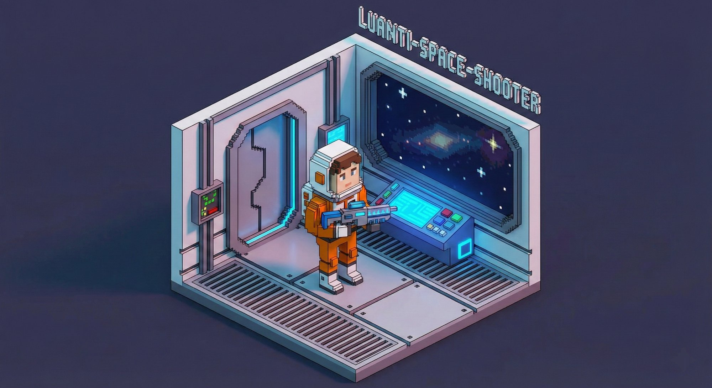

# 🚀 Space Shooter - FPS Mod for Luanti



A wave-based first-person space shooter mod for [Luanti](https://www.luanti.org/) (formerly Minetest). Fight off alien invaders in a space station arena!

## Features

- **4 Weapons**: Laser Gun, Plasma Rifle, Rocket Launcher, and the unlockable Railgun
- **3 Enemy Types**: Alien Grunts, Elite Aliens, and Boss Aliens
- **Wave System**: Endless waves of increasing difficulty with boss waves every 5th round
- **Combo System**: Chain kills for score multipliers (up to 5x)
- **Pickups**: Health packs, ammo crates, and shield pickups dropped by enemies
- **Custom HUD**: Score, wave counter, ammo display, shield indicator, combo tracker
- **Auto-generated Arena**: Space station arena with pillars for cover, glass windows, and spawn pads
- **Particle Effects**: Muzzle flashes, projectile trails, beam effects, explosions, and ambient space particles

## How to Play

1. Install the mod in your Luanti `mods/` folder
2. Enable the mod in your world settings
3. Join the game and type `/space_shooter` to start
4. Use **left-click** to fire your equipped weapon
5. Switch weapons with **hotbar keys (1-4)**
6. Survive as many waves as you can!
7. Type `/space_quit` to end your game

## Weapons

| Slot | Weapon | Damage | Fire Style | Starting Ammo | Wave Bonus | Notes |
|---|---|---|---|---|---|---|
| 1 | Laser Gun | 3 | Rapid fire projectile | 100 | +20 | Fast and reliable |
| 2 | Plasma Rifle | 8 | Medium projectile | 30 | +5 | High single-target damage |
| 3 | Rocket Launcher | 20 | Slow, splash damage | 10 | +2 | AOE within 3 nodes |
| 4 | Railgun | Instant kill | Penetrating beam | 5 (on unlock) | +1 | **Unlocks at Wave 10** |

### Railgun

The Railgun is a devastating weapon that unlocks when you reach **Wave 10**. It fires a penetrating beam that passes through every enemy in its path and kills them instantly, regardless of HP — including bosses. Use it wisely as ammo is extremely scarce.

- **Unlock:** Wave 10 (granted automatically with 5 rounds)
- **Wave bonus:** +1 round per wave (after unlock)
- **Ammo pickup bonus:** +2 rounds
- **Range:** 100 nodes, penetrates all enemies along the beam

## Ammo Pickups

Enemies have a 20% chance to drop an ammo pack on death. Each ammo pack gives:

- +30 Laser
- +10 Plasma
- +3 Rockets
- +2 Railgun (only after unlock)

## Commands

| Command | Description |
|---|---|
| `/space_shooter` | Start a new game |
| `/space_quit` | End current game |

## Wave Progression

- Base aliens increase by 2 per wave
- Elite aliens appear from Wave 3+
- Boss aliens appear every 5th wave
- Railgun unlocks at Wave 10
- Ammo is replenished between waves
- Player heals 5 HP between waves

## Installation

```
cd ~/.luanti/mods/
# Copy or clone the space_shooter folder here
```

Make sure the mod is enabled in your world's mod settings.

## No Dependencies

This mod has **no dependencies** — it works standalone with any Luanti game or even with no game at all.

## License

Code: MIT
Textures: CC0 (Public Domain)
